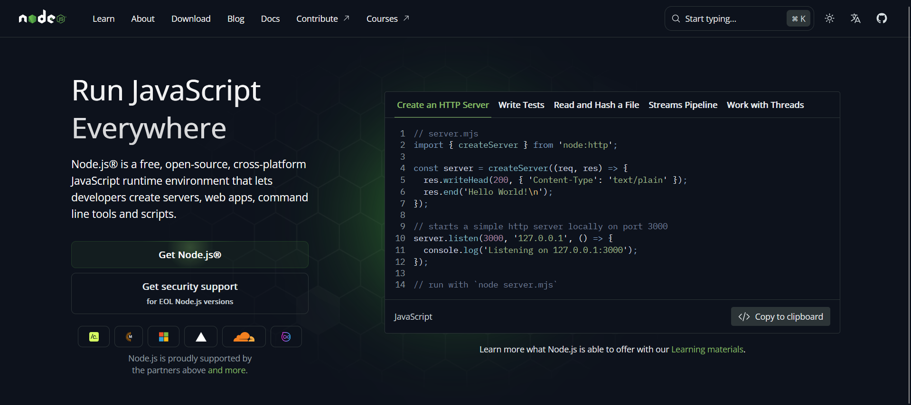
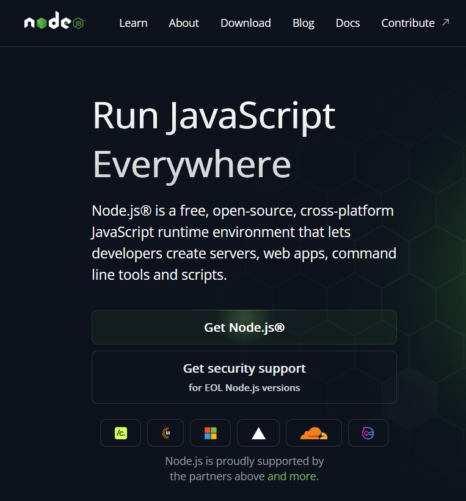
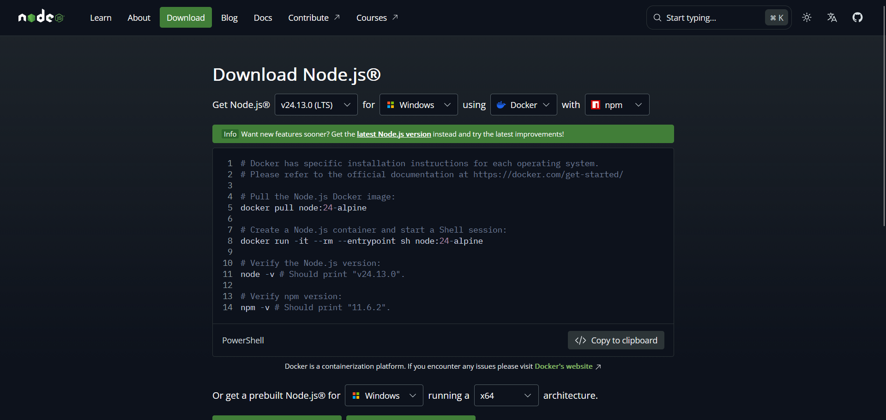
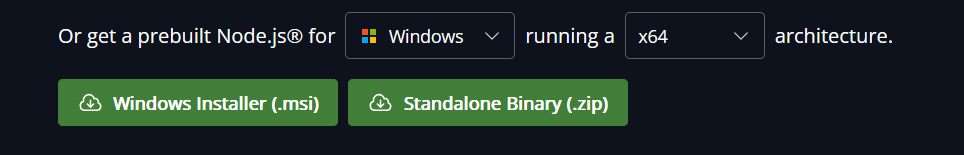

 ### [Voltar](https://github.com/Davi-Prussek/programacao-II/blob/main/01_introducao-ao-typescript/01_O%20que%20%C3%A9%20TypeScript/README.md)

# Configuração do Node.js LTS

Este guia ensina como instalar a versão **LTS (Long Term Support)** do Node.js,
que é estável e recomendada para estudos e desenvolvimento de projetos em
TypeScript.

---

## 1. Windows

 
 ### 1. Acesse o site oficial: [https://nodejs.org](https://nodejs.org)  

#

  

#

### 2. Após entrar, clique em **Get node.js**

# 

  

 
### Você vai ser levado para essa página:


#

 ### 3. Baixe o instalador **LTS** (arquivo `.msi`)  



#

 ### 4. Execute o instalador:
   
   - Aceite os termos
   - Marque a opção para adicionar o Node ao PATH
   - Mantenha as opções padrão
     

 ### 5. Abra o **Prompt de Comando** ou **PowerShell** e verifique:
 
  # 
  
  ### **ATENÇÃO:**
  Rode os dois comandos separadamente pra evitar confusões desnecessárias
  
  #
  
```bash
node -v
```
   O primeiro comando verifica a versão do node instalado na máquina.
```bash
npm -v
```
   O segundo comando mostra a versão do npm que veio com o node.


# [Deu tudo certo? pode ir para próxima parte do tutorial e ignorar o resto dessa etapa!](https://github.com/Davi-Prussek/programacao-II/blob/main/01_introducao-ao-typescript/03_Diferen%C3%A7as%20de%20JS%20pra%20TS/README.md)

 ## Caso dê algum erro, o que fazer: 
  
 Tem alguns casos possíveis, que são:
  
  ### 1. **node -v** não funciona:

**Causa:** 
  
  Node.js não instalado corretamente ou não adicionado ao PATH.

**Solução:**

  - Desinstale o Node.js
  
  - Reinstale pelo site oficial
  
  - Durante a instalação, marque:
  
  > Add to PATH
  
  - Feche e abra o terminal
  
  - Teste novamente e separadamente:
  
  ```bash
  node -v
  npm -v
  ```

### 2. **node -v** funciona, mas **npm -v** não:

  Verifique se o npm existe no PATH:

  ```bash
  where npm
  ```

  - **Caso A:**
    
    Aparecem npm e npm.cmd
  
    ```files
    C:\Program Files\nodejs\npm
    C:\Program Files\nodejs\npm.cmd
    ```

    **Causa:** PowerShell bloqueando scripts

    **Solução:**

    - Insira este comando no terminal:
    
    ```
    Set-ExecutionPolicy RemoteSigned -Scope CurrentUser
    ```

    - Digite Y e depois feche o terminal e teste:

    ```bash
    npm -v
    ```
    
  - **Caso B:**

    **where npm** não retorna nada

    **Causa:** npm não está no PATH

    **Solução:**

    - Reinstalar o Node.js
    - Garantir que a opção **Add to PATH** esteja marcada

  ### 3. **npm.cmd** funciona, mas **npm** não:

  **Causa:** Execution Policy do PowerShell.

**Solução:**

- Rode o seguinte código no terminal:

  ```bash
  Set-ExecutionPolicy RemoteSigned -Scope CurrentUser
  ```
  Este código define a política de execução de scripts do PowerShell.

- Teste novamente e separadamente:

```bash
node -v
npm -v
```

## 2. Linux

 1. ### Rode no terminal da máquina os seguintes comandos: 

  ```bash
  sudo apt update
  sudo apt install -y nodejs npm
  ```

  - O primeiro comando atualiza o catálogo de pacotes do seu linux.
  - O segundo instala o node.js.

 ### 2. Verifique a versão do node.js e do npm

```bash
node -v
npm -v
```
  - Verifique no site oficial [nodejs.org](https://nodejs.org/en) se a versão exibida é a LTS, caso for, pode ignorar os próximos passos.
  > Caso não seja, siga os próximos passos:
    
  - Instale o nvm rodando este comando no terminal da máquina:

     ```bash
     curl -o- https://raw.githubusercontent.com/nvm-sh/nvm/v0.39.6/install.sh | bash
     ```
  
   - Ative o nvm no terminal da máquina:
  
     ```bash
     source ~/.bashrc
     ```
  
   - Instalar a versão LTS do Node.js:
  
     ```bash
     nvm install --lts
     ```
  
   - Usar a versão LTS como padrão:
  
     ```bash
     nvm use --lts
     nvm alias default lts/*
     ```  
       - O primeiro comando ativa o LTS somente na aba do terminal atual.
       - O segundo comando ativa o LTS como padrão do sistema.
  
   - Rode novamente o comando para ver qual a versão do node no terminal:
  
     ```bash
     node -v
     ```

## [A versão exibida foi LTS? pode continuar para o próximo passo aqui!](https://github.com/Davi-Prussek/programacao-II/blob/main/01_introducao-ao-typescript/03_Diferen%C3%A7as%20de%20JS%20pra%20TS/README.md)


